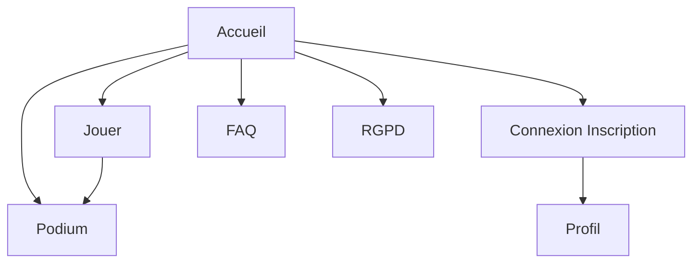

<!-- EXPLICATION FICHIER: docs/03-sitemap-et-structure.md - Document de reference pour le projet. -->
# Sitemap et structure du site

## Sitemap

- /
- /play
- /leaderboard
- /auth
- /profile
- /faq
- /legal

## Diagramme de navigation

## Structure technique

- frontend/
  - src/pages
  - src/components
  - src/services
  - src/data
- backend/
  - src/controllers
  - src/models
  - src/routes
  - src/middleware
  - sql/
