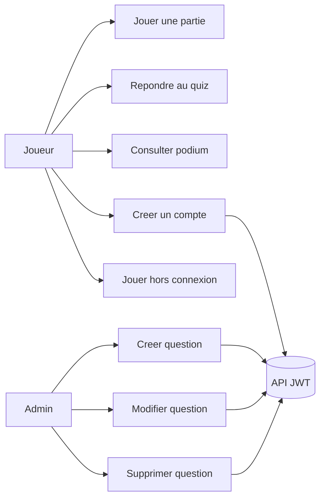

<!-- EXPLICATION FICHIER: docs/04-diagramme-utilisation.md - Document de reference pour le projet. -->
# Diagramme d'utilisation

```mermaid
flowchart LR
  U[Joueur] --> U1[Jouer une partie]
  U --> U2[Repondre au quiz]
  U --> U3[Consulter podium]
  U --> U4[Creer un compte]
  U --> U5[Jouer hors connexion]

  A[Admin] --> A1[Creer question]
  A --> A2[Modifier question]
  A --> A3[Supprimer question]

  U4 --> API[(API JWT)]
  A1 --> API
  A2 --> API
  A3 --> API
```
