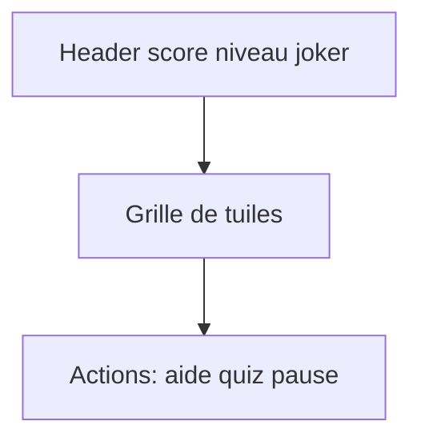
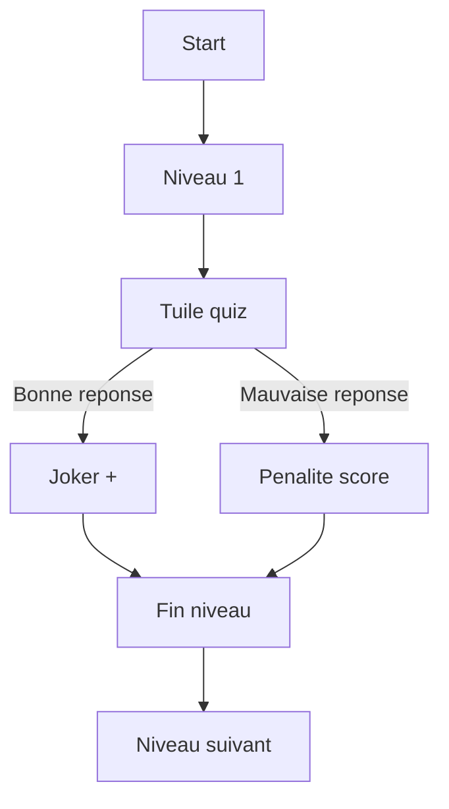

<!-- EXPLICATION FICHIER: docs/06-wireframe-maquette-prototype.md - Document de reference pour le projet. -->
# Wireframe, maquette, prototype

## Wireframe ecran jeu (mobile first)

## Maquette fonctionnelle

- Header sticky avec score, niveau, bouton joker.
- Grille responsive 4 colonnes mobile, 5 tablette, 6 desktop.
- Carte quiz en bas de grille quand tuile ? activee.
- Navigation top vers podium, profil, legal.

## Prototype de parcours

