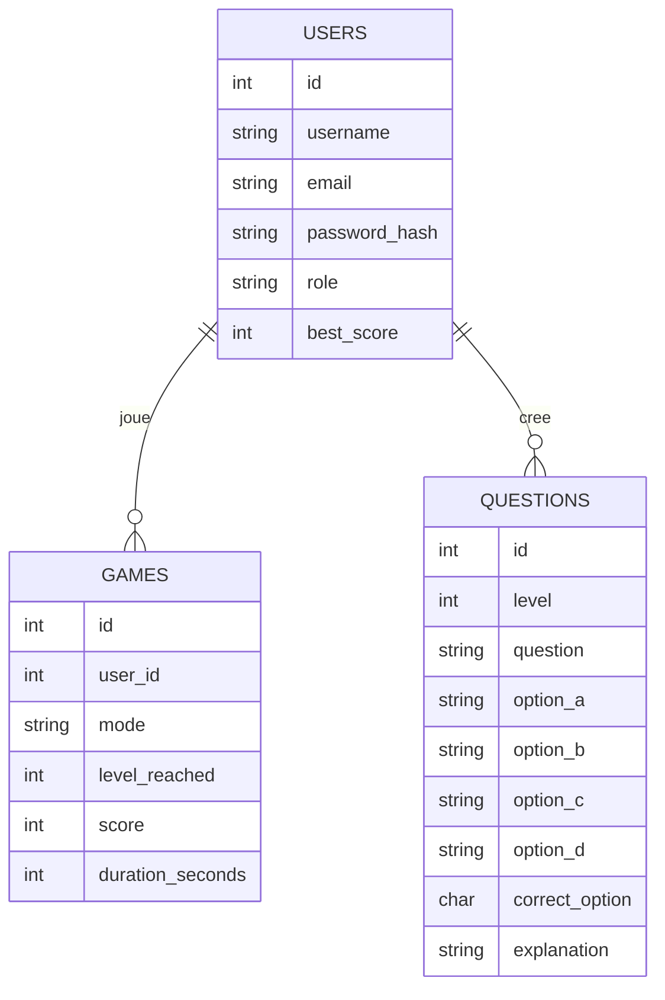

<!-- EXPLICATION FICHIER: docs/07-base-de-donnees-mcd-mld-mpd.md - Document de reference pour le projet. -->
# Base de donnees, MCD, MLD, MPD, DDL

## MCD (conceptuel)

## MLD (logique relationnel)

- users(id PK, username UQ, email UQ, password_hash, role, best_score, created_at)
- games(id PK, user_id FK -> users.id, mode, level_reached, score, duration_seconds, created_at)
- questions(id PK, level, question, option_a, option_b, option_c, option_d, correct_option, explanation, created_at)

## MPD (physique)

- PostgreSQL 16+
- Index principal: games(score DESC)
- Index secondaire: questions(level)

## DDL SQL

- Script: backend/sql/schema.sql

## AlwaysData

- Moteur recommande: PostgreSQL.
- Variables a configurer cote hebergeur: DATABASE_URL, JWT_SECRET, CORS_ORIGIN.
- L'application peut etre publiee via deployment Docker ou Node direct selon offre.
- 