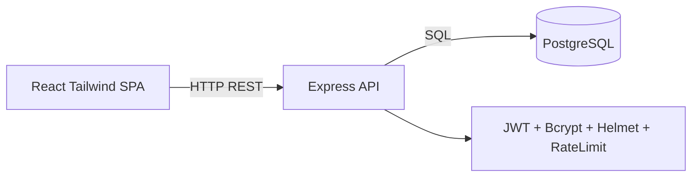

<!-- EXPLICATION FICHIER: docs/08-architecture-technique.md - Document de reference pour le projet. -->
# Architecture technique et plan du site

## Architecture applicative

## MVC backend

- Models: acces et requetes SQL.
- Controllers: logique metier.
- Routes: endpoints REST.
- Middleware: auth JWT + role admin.

## Plan de deploiement

- Option 1: Docker Compose local.
- Option 2: Render (frontend static + backend web service + PostgreSQL).
- Option 3: AlwaysData (API Node + DB PostgreSQL).
