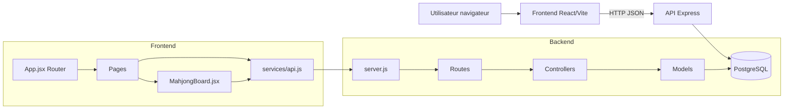

<!-- EXPLICATION FICHIER: docs/09-architecture-code-runtime.md - Document de reference pour le projet. -->
# 09 - Architecture du code et flux runtime

Ce document explique comment le backend et le frontend collaborent pendant l'execution.

## Vue d'ensemble

## Backend

- Entree: `backend/src/server.js`
- Securite globale:
  - `helmet`
  - `cors`
  - `express-rate-limit`
- Auth JWT:
  - `backend/src/middleware/authMiddleware.js`
- Couche routes:
  - `backend/src/routes/*.js`
- Couche logique metier:
  - `backend/src/controllers/*.js`
- Couche acces DB:
  - `backend/src/models/*.js`
- Connexion PostgreSQL:
  - `backend/src/config/db.js`

### Flux type: connexion

1. Front envoie `POST /api/auth/login`
2. `authRoutes` route vers `authController.login`
3. `userModel.findUserByEmail` lit la base
4. `bcrypt.compare` valide le mot de passe
5. API renvoie `token + user`

### Flux type: score de partie

1. Front envoie `POST /api/games`
2. Middleware `requireAuth` verifie le JWT
3. `gameController.postGame` cree la partie
4. `userModel.updateBestScore` met a jour le record utilisateur

## Frontend

- Boot et router:
  - `frontend/src/main.jsx`
  - `frontend/src/App.jsx`
- Moteur de jeu:
  - `frontend/src/components/MahjongBoard.jsx`
- Donnees gameplay:
  - `frontend/src/data/boardLayouts.js`
  - `frontend/src/data/quizQuestions.js`
- Appels API:
  - `frontend/src/services/api.js`
- Pages:
  - `frontend/src/pages/*.jsx`
- Theme/UI global:
  - `frontend/src/styles.css`

### Flux type: partie locale + quiz

1. `MahjongBoard` genere un plateau (layouts ASCII)
2. Le joueur clique des tuiles libres
3. Si tuile quiz, une question est tiree depuis `quizQuestions`
4. Reponse juste: gain de ressource (joker, shuffle, intuition, undo)
5. Fin de niveau: progression et eventuelle sync API si token

## Decisions techniques cle

- Separation claire routes/controllers/models cote API
- Front reactif state-driven (hooks React)
- Fallback local quand API indisponible (ex: leaderboard)
- Progressive enhancement mobile (barre sticky d'actions)
